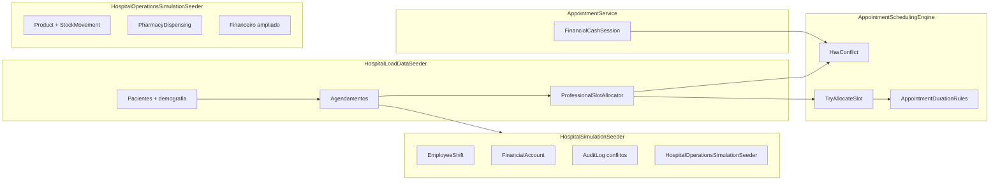

# Hospital Simulation Engine (GTH)

Motor de agendamento e simulação pós-carga para o projeto **sistema-hospitalar**. Evita conflitos de horário entre profissionais durante a geração de massa de dados e orquestra artefatos operacionais (turnos, contas financeiras, auditoria).

## Arquitetura



### Componentes

| Componente | Local | Responsabilidade |
|------------|-------|------------------|
| `AppointmentSchedulingEngine` | `Infrastructure/Services/` | Detecção de sobreposição de intervalos; regras de duração |
| `ProfessionalSlotAllocator` | mesmo arquivo | Estado em memória por profissional; aloca próximo slot livre |
| `SchedulingBusinessHours` | mesmo arquivo | Seg–Sex 08:00–18:00 (configurável), passo de 15 min |
| `HospitalLoadDataSeeder` | `Infrastructure/Persistence/` | Carga de pacientes com demografia realista e agenda sem conflito |
| `HospitalSimulationSeeder` | `Infrastructure/Persistence/` | Turnos, contas a receber, TISS e auditoria pós-carga |
| `HospitalOperationsSimulationSeeder` | `Infrastructure/Persistence/` | Farmácia, estoque, financeiro ampliado (propostas, honorários, caixas, TPA, folha) |

## Regras de conflito

Um agendamento **bloqueia** o horário quando:

- `IsActive == true`
- `Status` **não** é `Cancelled` nem `NoShow`

Dois intervalos conflitam quando:

```
existente.Início < candidato.Fim  AND  existente.Fim > candidato.Início
```

Onde `Fim = ScheduledAt + DurationMinutes`.

Esta é a mesma lógica usada em `AppointmentService.CreateAsync` (via `AppointmentSchedulingEngine.IntervalsOverlap` e `IsBlocking`).

## Durações por tipo

| Tipo (`AppointmentKind`) | Minutos |
|--------------------------|---------|
| Consulta | 30 |
| Retorno | 15 |
| Exame | 45 |

## Demografia na carga

- **Sexo:** 52% feminino (sempre `Male` ou `Female`)
- **Contato:** e-mail `paciente{N}@gth-load.local`, telefone fixo + celular com DDD variado
- **Endereço:** rua, bairro e CEP básicos
- **Faixa etária:** 0–12 (15%), 13–59 (70%), 60+ (15%)
- **Convênio:** SUS 40%, convênio privado 50%, Particular 10% (`PatientInsurance`)

Agendamentos: 1–5 por paciente (configurável), histórico coerente (passado `Completed` + opcional futuro `Scheduled`/`Confirmed`), `DurationMinutes` explícito.

**Sala de espera:** ~40 agendamentos para o dia atual (08h–17h) com status `Scheduled`, `Confirmed` ou `InProgress`, sem conflito de horário.

**Pronto-socorro:** ~15 `EmergencyVisit` com `Status=Waiting` e `ArrivedAt` hoje.

O `ProfessionalSlotAllocator` é criado **uma vez** por execução, pré-carregado com agendamentos já existentes no banco e mantido entre lotes (`BatchSize`).

## Opções (`HospitalLoadDataOptions`)

| Propriedade | Padrão | Descrição |
|-------------|--------|-----------|
| `SimulationDays` | 30 | Janela retroativa para turnos |
| `UseSmartScheduling` | true | Usa o motor na carga |
| `AppointmentsPerPatientMin` | 1 | Mínimo de consultas por paciente |
| `AppointmentsPerPatientMax` | 5 | Máximo de consultas por paciente |
| `RunSimulation` | false | Dispara `HospitalSimulationSeeder` |

## Como executar

### Pré-requisitos

- PostgreSQL de **teste** (nunca produção)
- Variável de ambiente obrigatória: `GTH_ALLOW_LOAD_SEED=true`

### Script PowerShell

```powershell
.\scripts\seed-hospital-simulation.ps1 -Patients 500 -Simulation -Clear
```

Parâmetros úteis: `-SimulationOnly`, `-NoSmartScheduling`, `-AppointmentsMin`, `-AppointmentsMax`, `-SimulationDays`, `-Database`.

### CLI direta

```powershell
$env:GTH_ALLOW_LOAD_SEED = "true"
$env:ConnectionStrings__DefaultConnection = "Host=localhost;Port=5432;Database=sistema_hospitalar_test;Username=postgres;Password=postgres"

# Carga + simulação
dotnet run --project tools/HospitalLoadSeed -- --patients 1000 --simulation

# Apenas simulação sobre pacientes já marcados (gth-load-seed-v1)
dotnet run --project tools/HospitalLoadSeed -- --simulation-only

# Desativar agendamento inteligente (não recomendado)
dotnet run --project tools/HospitalLoadSeed -- --no-smart-scheduling
```

### Simulação pós-carga

Com `--simulation` ou `--simulation-only`:

1. **EmployeeShift** — turnos aleatórios nos últimos N dias úteis
2. **FinancialAccount** — contas a receber para consultas `Completed` via `FinancialAccountService.CreateFromAppointmentAsync`
3. **Propostas (orçamentos)** — ~35% dos pacientes com contas abertas, parciais, pagas e vencidas; itens de linha e pagamentos
4. **Contas a pagar** — fornecedor, utilidades, folha e manutenção (abertas, parciais e pagas)
5. **TISS** — guias e lotes para ~10% das consultas de convênio; contas `InsuranceReceivable` vinculadas
6. **HospitalOperationsSimulationSeeder** — farmácia + financeiro ampliado (ver tabela abaixo)
7. **AuditLog** — registra conflitos remanescentes (deve ser zero com smart scheduling)

### Artefatos operacionais (`HospitalOperationsSimulationSeeder`)

| Entidade | SKU / campo | Quantidade alvo |
|----------|-------------|-----------------|
| Product | `GTH-LOAD-MED-*`, `GTH-LOAD-SUP-*` | ~50 meds + ~15 insumos |
| StockMovement | `Reference` | ~200+ |
| ProductBillingRule | CMED | ~40 |
| PharmacyDispensing | `Notes` | ~80 |
| FinancialAccount | `Notes` / descrição | ~300+ total |
| FinancialCashSession | `Notes` | 1 aberta + ~20 fechadas |
| MiscellaneousReceipt | `GTH-LOAD-REC-*` | ~25 |
| PayrollRun | `Notes` | 3 meses |
| TpaClaim | `Notes` | ~15 |
| TissGuide / TissBatch | `Notes` / `GTH-LOAD-YYYYMM` | ~20 guias |

Limpeza com `--clear` remove todos os artefatos acima via `ClearMarkedOperationsDataAsync`.

A listagem de pacientes (`PatientDto`) expõe `OpenReceivableCount`, `LastAppointmentAt` e `NextAppointmentAt` para colunas Propostas / Últ. Agend. / Próx. Agend.

## Marcador de dados

Pacientes gerados usam `Notes` iniciando com `gth-load-seed-v1`. Limpeza: `--clear`.

## Segurança

A carga e a simulação **falham** sem `GTH_ALLOW_LOAD_SEED=true`. Use banco dedicado de testes.
